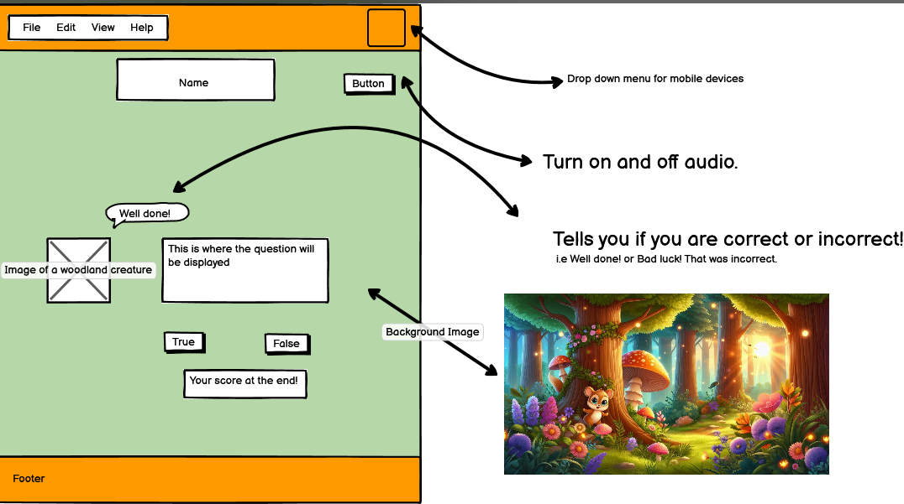
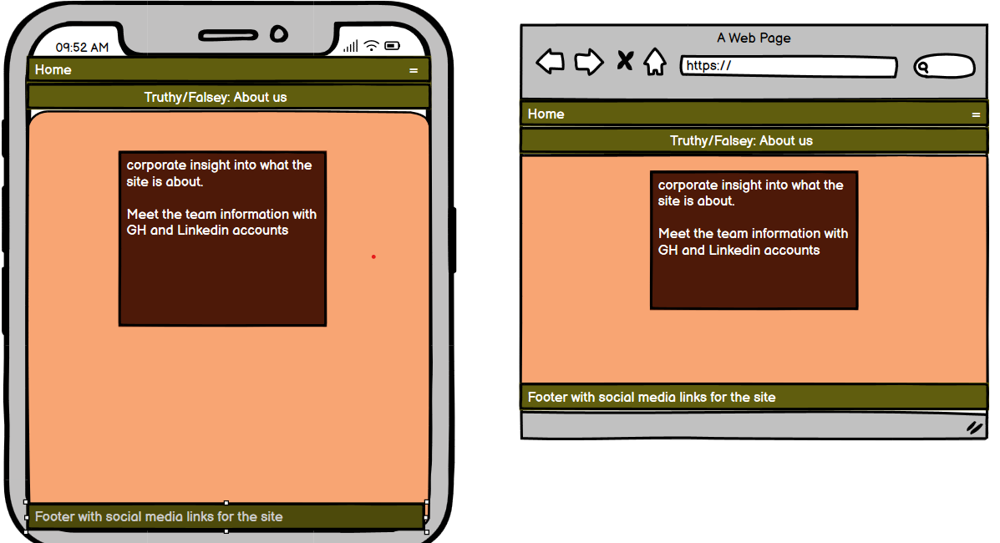
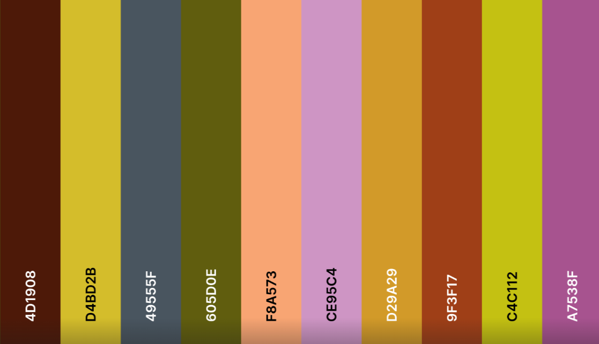
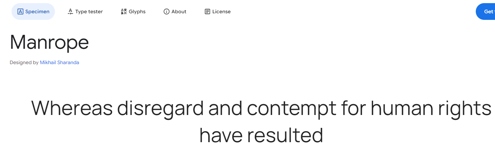

# Truthy/Falsey

[View live project here on GitHub](https://heath1979.github.io/Truthy-Falsey/)

Truthy or Falsey is a quiz website aimed at young children in and aligned with educational requirements. Currently the organisation are looking at animals in the natural world and would like an interactive quiz that allows children to test their knowledge in a fun and interactive way.  The organisation would also like the function to create further quizzes that would align with the current curriculum.

   
  

---

## CONTENTS  
  
* [UXD (User Experience Design)](#user-experience-ux)
  * [User Stories](#user-stories) 
* [Creation process (Strategy -> Surface)](#creation-process)
  * [Wireframes](#wireframes)
* [Design](#design)
  * [Colour Scheme](#color-scheme)
  * [Typography](#typography)
  * [Imagery](#imagery)
* [Page Features](#page-features)
  * [Navbar](#navbar)
  * [brand-Image](#brand-image)
  * [Footer](#footer)  
* [Tablet & Mobile View](#tablet--mobile-view)
  * [Desktop, Tablet & Mobile Differences](#desktop-tablet--mobile-differences)
  * [Mobile View](#mobile-view-iphonese)
  * [Laptop View](#laptop-view-msi-modern-15-h-b13m)
* [Future Features](#future-features)
* [Technologies Used](#technologies-used)
  * [Languages Used](#languages-used)
  * [Frameworks, Libraries, Technologies & Programs Used](#frameworks-libraries-technologies--programs-used)
* [Deployment](#deployment)
  * [How to deploy](#how-to-deploy)
* [Testing](#testing)
  * [HTML Validation using W3C Validation](#html-validation-using-w3c-validation)
  * [CSS Validation using W3C Validation](#css-validation-using-w3c-validation)
  * [Lighthouse scores via Chrome Developer Tools](#lighthouse-scores-via-chrome-developer-tools)
  * [Bugs & Fixes](#bugs--fixes)
  * [Unsolved Bugs](#unsolved-bugs)
* [Credits](#credits) 

  
---    

## User Experience (UX)  
  
### **User Stories**  

### **Primary Goal**  
  
Truthy or Falsey is an interactive quiz aimed at young children to help test and enhance knowledge gained through the organisation curriculum. The site will have a landing page that explains what the site is about and how the game will work. A navigation menu will be placed at the top of the site to help navigate to the different quiz sections for adult UI. Links hidden in animals will available on the main page for children to access quizzes.

### **Visitor Goals** 

Visitors will be able to understand the layout of the site and what it is trying to achieve in terms of accessing the quiz and how to play. It will be fun and engaging and inspire people to make multiple returns to access new and updated quizzes.

### **First Time Visitor**

  - A user can understand what the website is about and how to access the different pages through the use of the navigation bar.
  - A user can have a fun and interactive experience by accessing the quiz pages.
  - A user will receive feedback on each answer with a supportive message.
  - A user will be able to keep track of correct and incorrect answers.
  - A user can find supporting social media links.

### **Returning Visitor**  

  - A user will be able to pick their favourite animal and understand which quiz they are accessing.
  - A user will be able to use the contact form to request updates and provide suggestions.
  
--- 

## Creation Process  
  
### **1. Strategy**  

- The organisation requires ad easy-to-read, dependable website that delivers clear information that allows for children to be able to understand how to play the quizzes.
- Links to social media sites should be available.
- The site will be optimised for tablet but should still be resposive amongst all screen sizes.
- The site must have a child friendly and engaging palette and should be age appropriate.
 - User engagement is an essential feature required for this website.
  
### **2. Scope**  

The Truthy or Falsey site must be available on a wide range of devices in order to support user activity. The main target audience is young children but adults should also be able to use in case the target audience needs early direction. Once initial direction has been demonstrated then it is expected that returning users should be able to navigate with ease. 
- The site is to contain quizzes that supplement educational requirements.
- Text must be clear and legible on any sized device and adhere to accessibility guidelines. 
- A guide to how to use the site will be available in the About section.
- For future development we should look at SEN needs and how changes to the website can be made to meet these criteria.
  
### **3. Structural**  

The design and layout of the website should be simple, functional and accessible. Users should be able to understand what the site is about from the landing page and quickly navigate to the desired page through a navigation menu. 
- Easy to identify, clickable links with a consistent layout. The design is to be predictable and aligned with current trends.
- Any buttons or links had to provide feedback to the user to identify their purpose in the form of a design change that followed the flow of the overall aesthetic.   

### **4. Skeleton**  

The site has been developed to be simple, clear, engaging, and familiar
- For the landing page the navigation menu should be evident in the top right of the screen with the home navigation button in the top left. The supporting header underneath will contain the site brand.
- Further navigation links will be provided in the landing page through clicking on animals.
- A large, clear image dominates the background with a view of a woodland.
- The landing page will be supported by an aboy page accessed through the menu.
- The page ends with the footer containing brand copyright. Social media links will be available on the About page.

### Wireframes  

Wireframe - Homepage Desktop
  

 

Wireframe - Quiz page Desktop
  

 

Wireframe - About us page Mobile and desktop
  

 

### **5. Surface**  

 A design was created so that on initial landing children would direct to the main body containing clickable links hideen behind animal images whilst adults would be drawn intuitively to the navigation menu at the head of the page.
 - A background image was used to supoprt engagement from the target market for the site.
 - The pallete is bright yet soft in line with modern standards.

Overall, the design was intended to engage children directly through the use of a wonderland woodland scene whilst Adults could engage the site through the use of the navigation menu as per industry standards
 
---   
  
## Design  

### **Color Scheme**  

The website uses a pallette of bright contempory pastels that align with colours used in contempory childrens media and literature. The belief is that this will provide a familiarity to the target audience and allow them to engage with ease.

  
### **Typography**  

  [Google Fonts](https://fonts.google.com/) was used to import Manrope and because it is a similar font to others used in Childrens promotional material and as such will add familiarity.

  
        
### **Imagery**  

  The imagery used across the main landing page and quiz pages is intended to draw in the user in an imaginary woodland scene. In line with a lot of childrens literature woodland scnes are ofthen depicted as a place of magic and wonder that allows the imagination to thrive.

---  

## Page Features  

### **Navbar**   

  

 
 

Navbar opens in mobile view, but displayed in larger screen sizes at the head of the page.
   

### **Brand Image**  

  

  

  

### **Footer**  

The footer contains clickable links to social media sites and is consistent across all screen sizes. These links will only be avaible on the about page as we feel that it is inapprpriate for children to mistakenly click links that direct the user to external sites.

---   

## Tablet & Mobile View  
 
### **Desktop, Tablet & Mobile Differences**  
  
To ensure responsivity we used flexbox in the CSS styling and Bootstrap for the header and navigation elements to ensure that content is aligned. The site is optimised for tablet but still responds across all screen sizes.
  
### **Mobile View (iPhone SE)**  
  

### **laptop view (MSI Modern 15 H B13M)**  
  

---  
                              
## Future Features  

- describe future feature in bullet points
  
---   
  
## Technologies Used    

### **Languages Used**   

- HTML5
- CSS3
- JavaScript

### **Frameworks, Libraries, Technologies & Programs Used**  

- Balsamiq - used to create wireframes and edit images 
- GitHub - used to save and store all files for this website  
- Git - used for version control
- Google Fonts - fonts were imported from here 
- Font Awesome - icons and their associated kit were downloaded from here  
- Google Dev Tools - to debug and for testing responsiveness 
- Google Lighthouse - for auditing the website
- W3C Validator - for validating the HTML and CSS code 
- Convertio - to compress images 
- Favicon.io - to create favicon 
- Bootstrap - to create the navigation element and header

## Deployment

### **How to deploy**  

GitHub was used to deploy the website. These were the steps taken to acheive this:  

1. Login to GitHub account
2. Navigate to the project repository, Truthy-Falsey
3. Click the Settings button near the top of the page
4. In the left-hand menu, find and click on the Pages button
5. In the Source section, choose 'main' from the drop-down, select branch menu
6. Select 'root' from the drop-down folder menu
7. Click 'Save' and after a few moments the project will have been made live and a link is visible at the top of the page

 

---  
    
## Testing  

### **Initial testing plan**

  I had planned for this site to be accessible and legible on all screen sizes. I deployed this site halfway through the project to test on real-world devices. These devices included:  
- MSI laptop 15.6"  
- iphone SE

### **Testing**    

Testing took place throughout the entire build using Dev Tools on Chrome and on the above real-world devices. The browsers used were:  
- Chrome   
- Edge  
- Safari  
 
The results of feature testing are as follows:  
  
| Page | Test | Pass/Fail |
| :----| :----| :--------:|
| All  | Navigation links bring the user to relevant section of the page | Pass |
| All  | Footer social media icons bring the user to relevant sites via a new tab | Pass |
| All  | Sections are responsive in different media sizes | Pass |

### **HTML Validation using W3C Validation**  

Index page HTML validation
  

   

   

### **CSS Validation using W3C Validation** 

MHFA CSS validation
  

   

   

### **Lighthouse scores via Chrome Developer Tools**   

For Desktop   

Lighthouse audit for Index page
  

 

  
### **Bugs & Fixes**  

| Bug | Section | Fix |
| :----| :----| :--------:|
| Menu not alligned correctly | All site | CSS used initialy. fixed through implentation of Bootstrap |

### **Unsolved Bugs** 

- Use bullet points for unsolved bugs

## Credits  
  
### **Content References**
All content written for the website is purely fictional and all questions used for the quiz aspect are generated from an external API.
 - [Code Institute](https://codeinstitute.net/ie/) for their HTML/CSS/JS learning material.
 - [p5js](https://editor.p5js.org/enickles/sketches/sC1UoT03B) for aid in writing JavaScript required for the functioanlity of the site.
 - [GeekProbin](https://www.youtube.com/watch?app=desktop&v=-cX5jnQgqSM) for references on building the quiz page.
 - [Freelancing free complete courses](https://www.youtube.com/watch?v=UF1Wk2J0vCE) for refernces on building the quiz page.
 - [Browserstack](https://www.browserstack.com/guide/how-to-make-images-responsive#:~:text=Start%20with%20the%20question%20%E2%80%9Chow,will%20adjust%20itself%20in%20accordance) on how to make images responsive.
 - [Stackoverflow](https://stackoverflow.com/questions/70056109/how-to-make-a-speech-bubble-with-css) for how to create a speech bubble.

### **Media References**  
  - [Google fonts](https://fonts.google.com/) for font used on the site.
  - [Font awesome](https://fontawesome.com/) for icons used on the site.
  - [Favicon](https://favicon.io/) for the favicon used for this site.
  -  for the color palette used on this site.
  - [Open Trivia Database](https://opentdb.com/api_config.php) for API used on this website.

### **Acknowledgements** 
- Add acknowledgments in bullet points.
